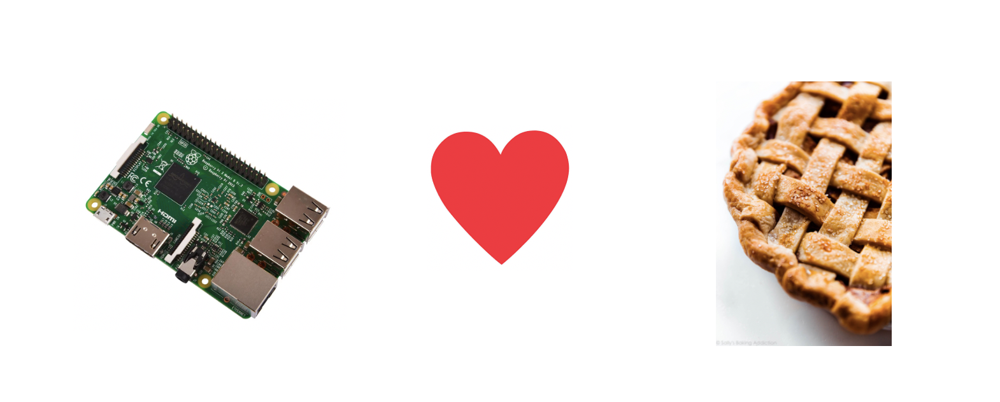
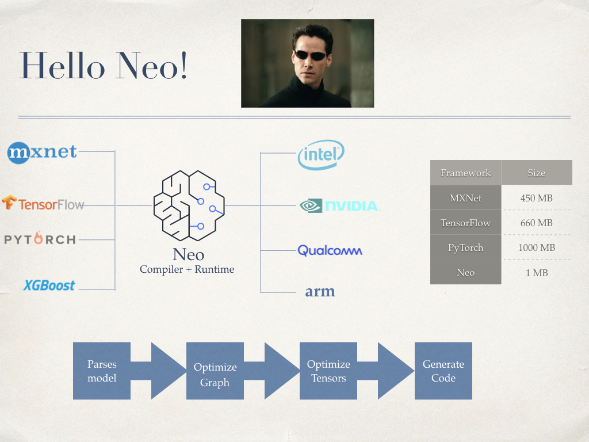
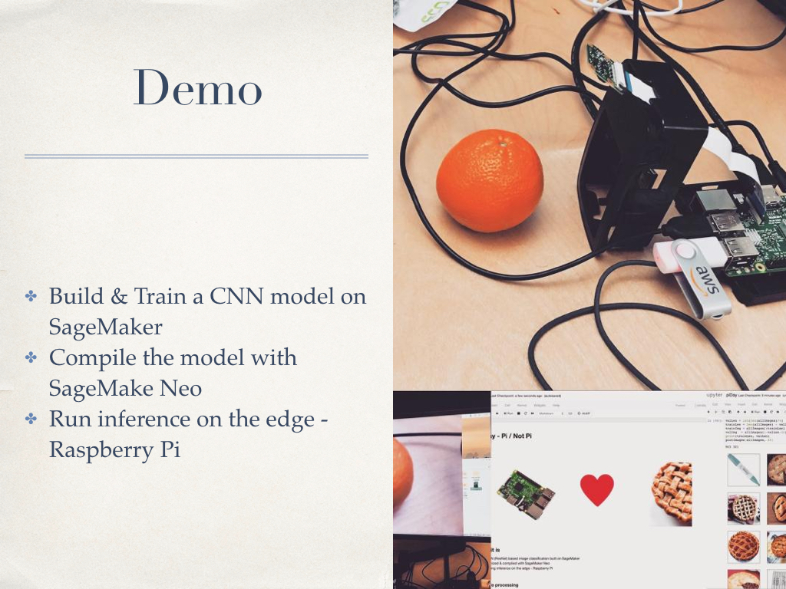

# Pie Not Pie

A project for Pi Day 2020 @ AWS. Running machine learning inference on an edge device, a Raspberry Pi in this case.

## What it is
* A CNN (ResNet) based image classification built on SageMaker
* Optimized & complied with SageMaker Neo
* Running inference on the edge - Raspberry Pi

## How it works

**Data Preprocessing** - Use the data pre processing part in the notebook to generate synthetic data from the raw images. This section will convert your images into a standard format that can be used as an input to the model.

**Build & Train** - We are using SageMaker inbuilt image classifier `` to build and train our model. This a supervised training with labels generated as part of preprocessing

**SageMaker Neo** 

Using SageMaker Neo we compile and optimize the model generated for RaspberryPi

**Deploy on Edge**

Before we can deploy the Neo compiled model to on the Pi we will need to install the runtime on Pi via this blog post https://aws.amazon.com/blogs/aws/amazon-sagemaker-neo-train-your-machine-learning-models-once-run-them-anywhere/

